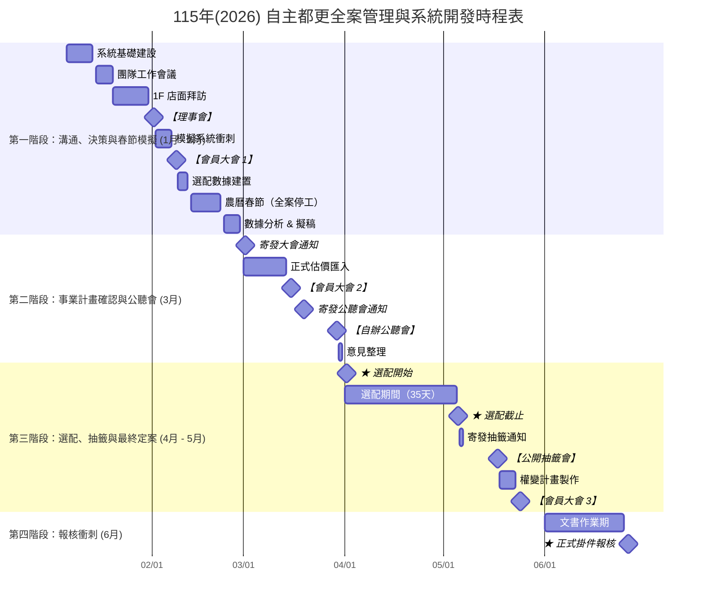

# 115 年(2026) 自主都更全案管理與系統開發時程表（甘特圖）

以下使用 **Mermaid Gantt**，可直接在支援 Mermaid 的 Markdown 檢視器中渲染。

- **修改日期**：調整每一行的起訖日期即可。
- **新增/刪除節點**：新增/刪除任務行即可。
- **放大/縮小範圍**：調整 `dateFormat` 與任務日期範圍；或在檢視器縮放。

---

**備註**
- CRM: Customer Relationship Management (地主關係管理)
- GAS: Google Apps Script (文件自動化)
- PCM: Professional Construction Management (全案管理團隊)
