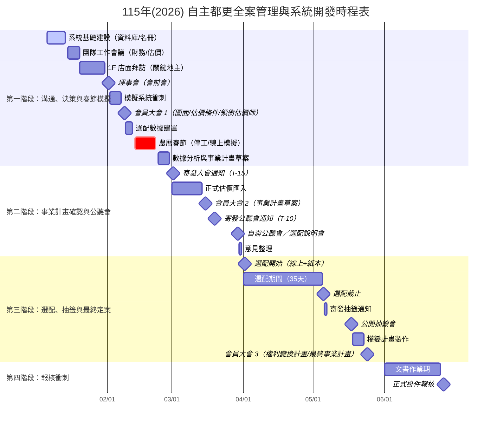

# 115年(2026) 自主都更全案管理與系統開發時程表（甘特圖版）

> 目標：115年6月26日 掛件報核 (事權併送)  
> 當前階段：115/01 (規劃與溝通期)

> ✅ **可修改性說明**  
> - 調整日期：直接修改甘特圖中每一行的 `YYYY-MM-DD`。  
> - 新增/刪除節點：新增或移除對應的 `task` 行即可。  
> - 放大/縮小日期範圍：修改 `dateFormat` 或在表格中調整日期。

> ℹ️ **若無法顯示甘特圖**  
> - 請確認檢視平台支援 Mermaid。  
> - 可將下方程式碼貼到 [Mermaid Live Editor](https://mermaid.live/) 觀看。  

## 補充：節點描述對照（含系統開發重點）
| 日期區間 | 關鍵事項 (Milestone) | 目的/任務 | 💻 系統開發重點 (Dev Tasks) |
| :--- | :--- | :--- | :--- |
| **01/06 - 01/14** | **系統基礎建設** | 建立資料庫與基礎架構 | Zeabur 部署 PostgreSQL；建立地主名冊 (Landlords DB) |
| **01/15 - 01/20** | **團隊工作會議** | 討論財務試算、初步估價結果 | 建置「財務版本庫」 (Financial Versions) |
| **01/20 - 01/31** | **1F 店面拜訪** | 針對關鍵地主溝通設計規劃 | 上線 CRM 訪談紀錄 (手機版) |
| **02/01** | **【理事會】** | 報告財務、圖面、選配規則 (會前會) | 產出「地主異議分析報告」 |
| **02/02 - 02/07** | **模擬系統衝刺** | 準備春節用的模擬選配資料 | 寫入 2/8 預定通過的圖面數據 |
| **02/08** | **【會員大會 1】** | 議決：平面圖、估價條件、領銜估價師 | 資料鎖定 (Data Freeze)：圖面定案 |
| **02/09 - 02/12** | **選配數據建置** | 匯入價值表，測試模擬系統 | 上線「春節模擬選配沙盒 (Sandbox)」 |
| **02/13 - 02/22** | **🔴 農曆春節** | 全案停工，開放地主線上模擬選配 | 系統自動化監控；估價師閉關趕工 |
| **02/23 - 02/28** | **數據分析 & 擬稿** | 分析模擬選配熱度；撰寫事業計畫草案 | NotebookLM 生成計畫書章節草稿 |
| **03/01** | **寄發大會通知** | 針對 3/15 大會 (法定 T-15) | n8n 發送行政提醒 |
| **03/01 - 03/14** | **正式估價匯入** | 領銜估價師交付正式報告 | 開發 Excel 自動匯入與檢核腳本 |
| **03/15** | **【會員大會 2】** | 議決：事業計畫草案 (確認建築/成本) | 數位簽到系統 (QR Code) |
| **03/19** | **寄發公聽會通知** | 針對 3/29 公聽會 (法定 T-10) | GAS 自動生成「權利價值通知單」 |
| **03/29** | **【自辦公聽會】** | 暨 選配說明會 (選配前資訊公開) | 上線「個人權益查詢頁」(查正式權值) |
| **03/30 - 03/31** | **意見整理** | 收集公聽會意見 | NotebookLM 整理意見回覆 |
| **04/01** | **★ 選配開始** | 開放正式選配 (線上+紙本) | 上線「正式選屋系統」(含找補計算) |
| **04/01 - 05/05** | **選配期間 (35天)** | 每日監控選配進度 | n8n 每日發送「選配戰報」給 PCM |
| **05/05** | **★ 選配截止** | 系統關閉，統計重複戶別 | 系統產出「重複選配衝突名單」 |
| **05/06 - 05/07** | **寄發抽籤通知** | 針對重複選配者發函 | GAS 生成抽籤通知書 |
| **05/17** | **【公開抽籤會】** | 決定重複戶別歸屬 | 現場投影抽籤結果畫面 |
| **05/18 - 05/23** | **權變計畫製作** | 將最終分配結果寫入計畫書 | GAS 自動填入分配清冊至 Word |
| **05/24** | **【會員大會 3】** | 議決：權利變換計畫 (及最終事業計畫) | 最終決策，鎖定所有數據 |
| **06/01 - 06/25** | **文書作業期** | 製作報告書、用印、掃描建檔 | 資料庫快照 (Snapshot) 存檔 |
| **06/26** | **★ 正式掛件報核** | 送件至市政府 | 系統發送結案通知 |
