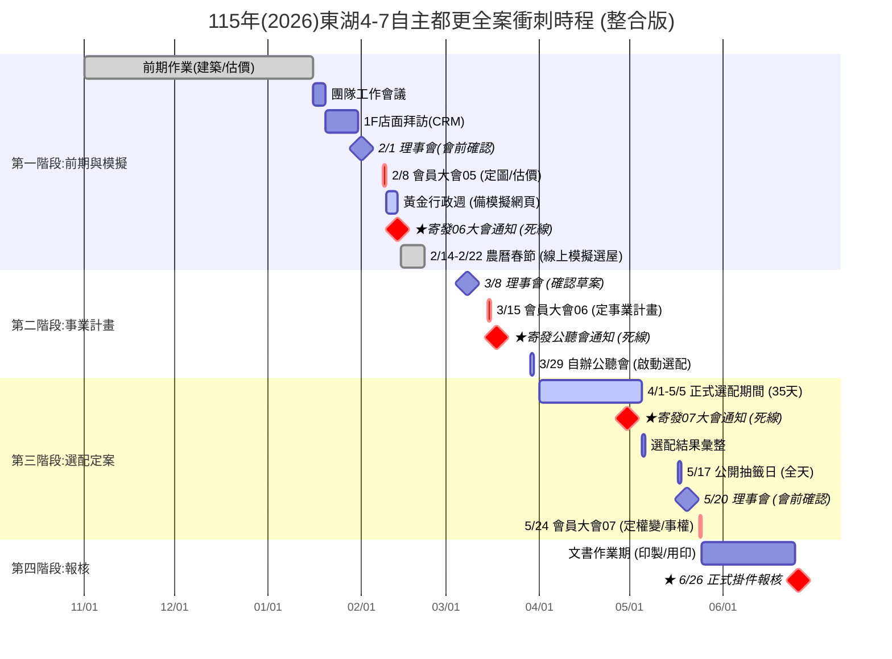

# 115年(2026)自主都更全案衝刺時程 (整合版)

```mermaid
gantt
    title 115年(2026)東湖4-7自主都更全案衝刺時程 (整合版)
    dateFormat  YYYY-MM-DD
    axisFormat  %m/%d
    todayMarker off

    section 第一階段:前期與模擬
    前期作業(建築/估價)       :done, a0, 2025-11-01, 2026-01-16
    團隊工作會議             :a1, 2026-01-16, 2026-01-20
    1F店面拜訪(CRM)          :a2, 2026-01-20, 2026-01-31
    2/1 理事會(會前確認)         :milestone, 2026-02-01, 0d
    2/8 會員大會05 (定圖/估價)    :crit, m1, 2026-02-08, 1d
    黃金行政週 (備模擬網頁)   :active, a3, 2026-02-09, 4d
    ★寄發06大會通知 (死線)    :crit, milestone, 2026-02-13, 0d
    2/14-2/22 農曆春節 (線上模擬選屋)   :done, a4, 2026-02-14, 2026-02-22

    section 第二階段:事業計畫
    3/8 理事會 (確認草案)        :milestone, 2026-03-08, 0d
    3/15 會員大會06 (定事業計畫)   :crit, m2, 2026-03-15, 1d
    ★寄發公聽會通知 (死線)    :crit, milestone, 2026-03-18, 0d
    3/29 自辦公聽會 (啟動選配)     :active, m3, 2026-03-29, 1d

    section 第三階段:選配定案
    4/1-5/5 正式選配期間 (35天)      :active, s1, 2026-04-01, 2026-05-05
    ★寄發07大會通知 (死線)    :crit, milestone, 2026-04-30, 0d
    選配結果彙整             :2026-05-05, 1d
    5/17 公開抽籤日 (全天)        :m4, 2026-05-17, 1d
    5/20 理事會 (會前確認)        :milestone, 2026-05-20, 0d
    5/24 會員大會07 (定權變/事權)  :crit, m5, 2026-05-24, 1d

    section 第四階段:報核
    文書作業期 (印製/用印)    :w1, 2026-05-25, 2026-06-25
    ★ 6/26 正式掛件報核            :crit, milestone, 2026-06-26, 0d
```
