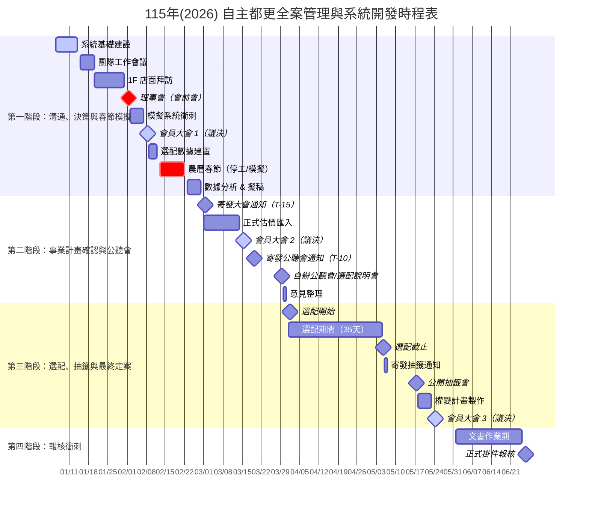
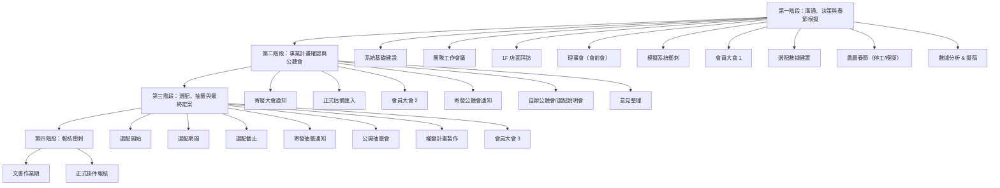

# 115年(2026) 自主都更全案管理與系統開發時程表（可編輯）

> 目標：115年6月26日 掛件報核 (事權併送)
>
> 說明：以下以 Mermaid 呈現，方便修改日期、增刪節點與縮放日期範圍。
>
> - **修改日期**：直接調整 `YYYY-MM-DD`。
> - **新增/刪除節點**：在對應階段增加/移除一行任務。
> - **縮放日期範圍**：在甘特圖區塊中調整 `dateFormat` 或起迄日期。

## 甘特圖（Gantt）

## 流程圖（Flowchart）

## 使用建議
- 若要縮小日期範圍（例如只看 4–6 月），可刪除甘特圖中的 1–3 月任務或調整 `axisFormat`。
- 若要新增節點，直接在甘特圖中新增一行，並在流程圖中補上對應節點。

---

**備註：**
* **CRM**: Customer Relationship Management (地主關係管理)
* **GAS**: Google Apps Script (文件自動化)
* **PCM**: Professional Construction Management (全案管理團隊)
