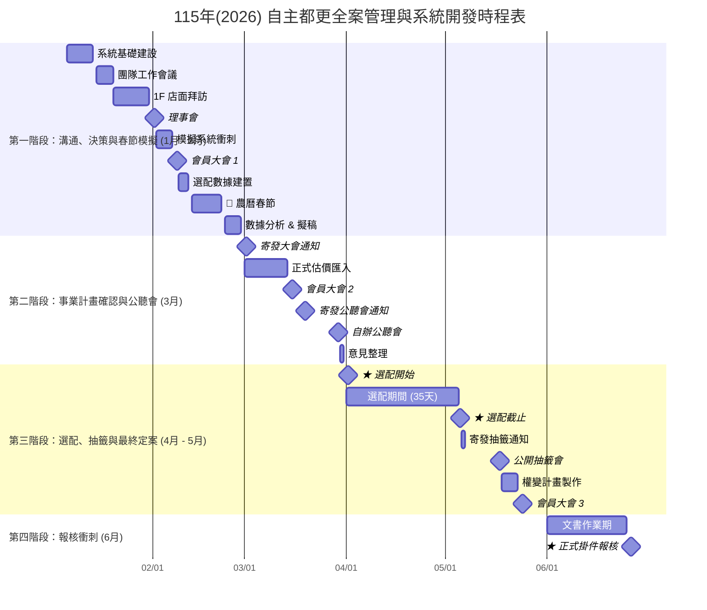

# 115年(2026) 自主都更全案管理與系統開發時程表 — 甘特圖

> 目標：115年6月26日 掛件報核 (事權併送)
> 當前階段：115/01 (規劃與溝通期)

以下使用 **Mermaid Gantt**，可直接修改日期、新增/刪除節點，或調整時間範圍。

## 使用說明
- 直接修改日期（YYYY-MM-DD）即可調整時程。
- 新增/刪除節點：在對應 section 加入或移除一行。
- 調整顯示範圍：可加上 `start`/`end` 或改 `axisFormat`。
